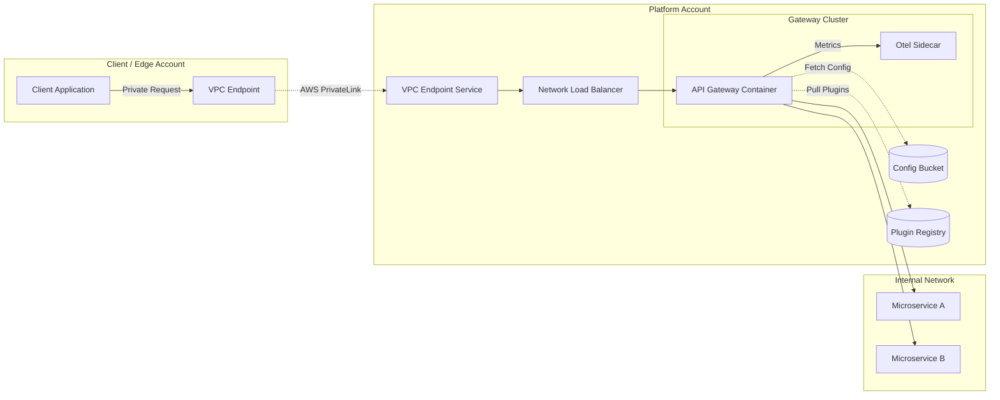
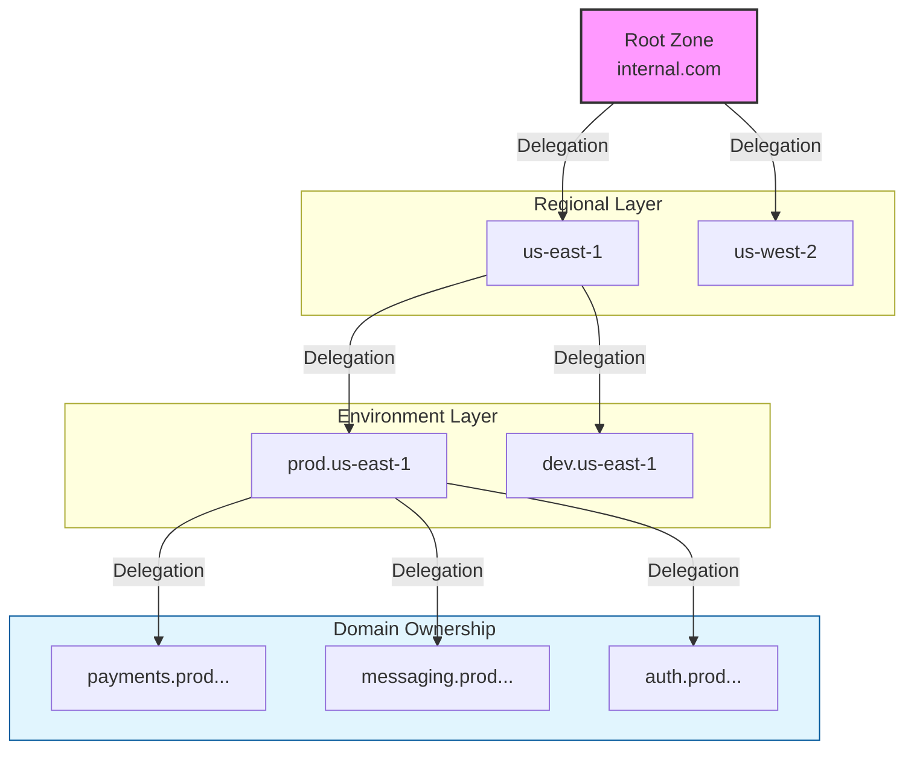
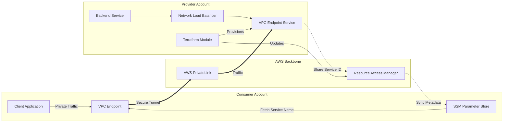
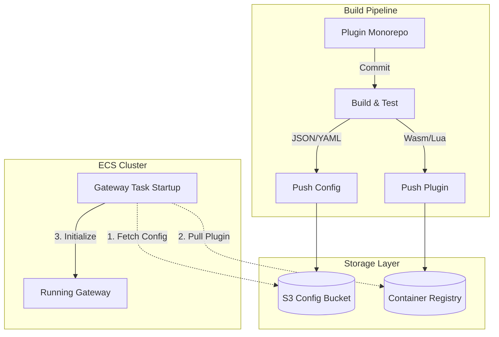

# Hi there, I'm Juan Felipe Gómez 👋

**Staff Software Engineer | Cloud Infrastructure & SRE | Kubernetes | Service Mesh & API Gateways**

I am a Telematics Engineer with over 10 years of experience in the lifecycle of Compute and Network infrastructure, ranging from on-premise data centers to large-scale cloud environments. Currently, I work as a **Staff Software Engineer** in the Twilio Platform Infrastructure area, specializing in **AWS, Kubernetes, Service Communications and Infrastructure as Code (Terraform)**.

I focus on designing resilient, high-traffic architectures, having led critical initiatives in **DNS infrastructure redesign, Service Mesh optimization, and Cloud Native API Gateways**.

---

### 🔭 Current Focus
* **AI Integration:** Automating infrastructure processes and decision-making using AI in cloud environments. 
* **Service Communication:** Improving performance and reliability via Service Mesh and API Gateways (Kong, Istio). 
* **Resiliency, Reliability and Scalability:** Maximizing availability (99.99%+) for mission-critical platform services.

---

### 🏗 Architecture Highlights

Here are some simplified representations of the high-scale infrastructure projects I have led, designed, implemented and operated.

#### 1. Cloud Native API Gateway Infrastructure
A scalable, secure API Gateway solution designed to handle millions of transactions per day. It features automated provisioning via Terraform, custom plugin management, and full observability using OpenTelemetry sidecars.

#### 2. Multi-Region Hierarchical DNS Strategy
A standardized, platform-agnostic DNS architecture enabling seamless service discovery across multiple Kubernetes clusters, regions and environments (e.g., service.region.env.domain.com) enabling the use of Cloud Native Domains. Thanks to this architecture new domains and services could be bootstrapped automatically, and could be discovered by any Twilio internal service in minutes.

#### 3. Automated Cross-Account Private Connectivity
A Terraform-driven architecture enabling zero-trust, private connectivity between distinct AWS accounts. It utilizes AWS RAM and SSM Parameters to automate the handshake between VPC Endpoint Services and Clients, eliminating manual coordination.

#### 4. Decentralized Gateway Configuration Pipeline
A robust GitOps workflow for managing API Gateway custom logic. This architecture decouples plugin development from infrastructure provisioning, allowing teams to build, push to ECR/S3, and deploy custom behavior dynamically at container startup.

#### 💼 Experience

#### Staff Software Engineer (L4) @ Twilio (2023 - Present)

**API Gateway & Cloud Native Domains:** Led the design and implementation of a Kong-based Domain Gateway, achieving ~ 3.39M aggregate RPS in stress tests.

**Observability:** Implemented OpenTelemetry sidecars for real-time metrics and created automated performance testing tools using k6.

**DNS Modernization:** Designed and implemented a centralized, agnostic DNS boundary to support multi-cluster and multi-region service discovery.

**Reliability and Resiliency:** Hardened Ingress Gateways and support the migration of network infrastructure to AWS Cloud WAN, improving success rates to 99.9%+.

**Public Ingress Capability:** Led the design and implementation of a public ingress capability to allow safely expose Kubernetes services to the public internet, following Twilio's security and compliance frameworks, integrated with Twilio's API.

#### Sr Software Engineer - Kubernetes Platform @ Twilio (2021 - 2023)

- Implemented Observability for initial Twilio Kubernetes Services using Datadog. Providing a monitoring and alerting system for critical services.

- Implemented and operated Argo CD for GitOps and automated rollouts for Kubernetes services. Ensured smooth and reliable updates to production environments.

- Deployed and operated more than 50 Kubernetes clusters in multiple regions and environments, developing and maintaining Terraform modules for consistent and repeatable infrastructure.

#### Site Reliability Engineer @ Adyton PBC (2020 - 2021)

- Built CI/CD systems from scratch using Bazel, GitLab Pipelines, and ArgoCD.

- Implemented robust infrastructure on AWS (Standard and GovCloud) for mission-critical services.

### 🛠️ Technologies & Tools

Cloud & Infra: AWS, Terraform, Kubernetes (EKS), Docker, Helm.

Connectivity: Kong API Gateway + plugins, Istio, Envoy, DNS (Route53).

Observability: Datadog, Prometheus, Grafana, OpenTelemetry.

CI/CD: ArgoCD, Jenkins, Buildkite.

Languages: Python, Go, HCL.

   
